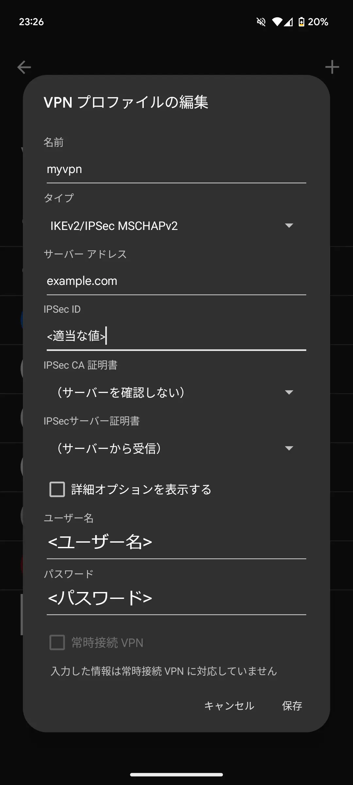
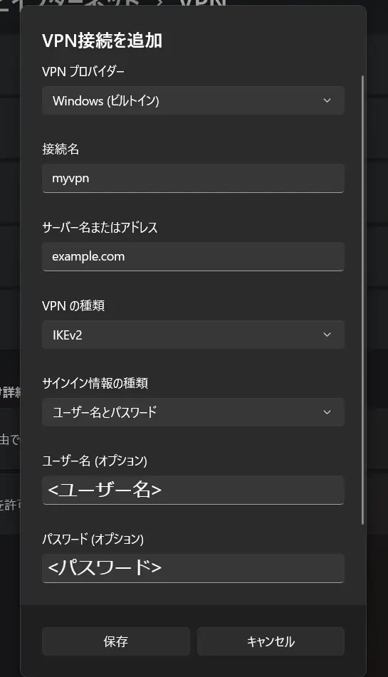

[前回](/posts/20241006/android12-strongswan/)は`IKEv2/IPSec PSK`で接続できるように構成したが、今回は`IKEv2/IPSec MSCHAPv2`で接続できるようにする。  
今回もUbuntu 24.04で検証を行った。

## 1. インストール
基本的に[前回](/posts/20241006/android12-strongswan/#1-%E3%82%A4%E3%83%B3%E3%82%B9%E3%83%88%E3%83%BC%E3%83%AB)と同じだが、追加で`libcharon-extra-plugins`をインストールする。

## 2. strongswan.confの編集
ここも[前回](/posts/20241006/android12-strongswan/#2-strongswanconf%E3%81%AE%E7%B7%A8%E9%9B%86)と同様。

## 3. サーバー証明書の設定
自己証明書を使うことも可能だが、いちいちクライアントにCA証明書をインポートする必要があるのでLet's Encryptなどを使うのが楽。  
ここでは`example.com`としているので、適宜置き換える。   
鍵の形式は必ず`RSA`にする。（`RSA`にしないと一部接続できないクライアントがあるため）

### Let's Encryptを使う場合(Certbot)
```bash
$ sudo certbot certonly --key-type rsa -d example.com
$ sudo cp /etc/letsencrypt/live/example.com/privkey.pem /etc/swanctl/private/
$ sudo cp /etc/letsencrypt/live/example.com/fullchain.pem /etc/swanctl/x509/
$ sudo cp /etc/letsencrypt/live/example.com/chain.pem /etc/swanctl/x509ca/
```

### Let's Encryptを使う場合(Lego)
```bash
$ lego --key-type rsa2048 --email <EMAIL> --domains example.com --http run
$ sudo cp ~/.lego/certificates/example.com.key /etc/swanctl/private/
$ sudo cp ~/.lego/certificates/example.com.crt /etc/swanctl/x509/
$ sudo cp ~/.lego/certificates/example.com.issuer.crt /etc/swanctl/x509ca/
```

### 自己署名証明書を使う場合
以下のようにして作成する。
```bash
#CAの秘密鍵を作成
$ pki --gen --type rsa --size 4096 --outform pem > ca-key.pem

#CAの証明書を作成
$ pki --self --ca --lifetime 3650 --in ca-key.pem \
    --dn "C=CH, O=strongSwan, CN=strongSwan Root CA" \
    --outform pem > ca-cert.pem

#サーバーの秘密鍵を作成
$ pki --gen --type rsa --size 4096 --outform pem > server-key.pem

#サーバー証明書の作成
$ pki --pub --in server-key.pem | pki --issue --lifetime 3650 \
    --cacert ca-cert.pem \
    --cakey ca-key.pem \
    --dn "C=CH, O=strongSwan, CN=example.com" --san="example.com" \
    --flag serverAuth --flag ikeIntermediate --outform pem > server-cert.pem
    
#場所を移動
$ sudo mv server-key.pem /etc/swanctl/private/
$ sudo mv server-cert.pem /etc/swanctl/x509/
```

自己署名証明書を作成したら、CA証明書をクライアントにインストールする。

Android端末の場合は、`ca-cert.pem`を設定の`証明書のインストール`→`CA証明書`からインストールする。

Windowsの場合は、`ca-cert.pem`の拡張子を`crt`に変更しダブルクリック。
`証明書のインストール`→`ローカルコンピューター`→`証明書をすべての次のストアに配置する`で`信頼されたルート証明機関`を選択→`完了`の流れでインストールする。

## 4. 設定ファイルの作成
この例では、クライアントに`10.1.0.0/24`のアドレスを割り当てる。  
サーバーのIPは、NATの中にある場合は**グローバルIPではなくプライベートIPを入力する。**

`sudoedit /etc/swanctl/conf.d/mschapv2.conf`
```conf
connections {
  mschapv2 {
    version = 2
    send_cert = always
    pools = pool1
    proposals = aes128gcm16-aes256gcm16-sha1-sha256-sha384-modp1024,default #これがないとWindowsが接続できない

    local_addrs = <サーバーのIPかFQDN> #接続できない場合はプライベートIPや%anyを試す
    remote_addrs = %any	
    
    local {
      auth = pubkey
      id = <グローバルIPかFQDN>
      certs = <FILENAME> #/etc/swanctl/x509/に保存したサーバー証明書のファイル名
    }

    remote {
      auth = eap-mschapv2
      eap_id = %any
    }

    children {
      net {
        local_ts = 0.0.0.0/0 #クライアントにアクセスを許可するサブネット
      }
    }
  }
}

pools {
  pool1 {
    addrs = 10.1.0.0/24 #クライアントに割り振るIP
    #dns = 1.1.1.1,1.0.0.1
  }
}

secrets {
  eap-1 {
    id = <USERNAME>
    secret = <PASSWORD>
  }
}
```

## 5. ufwの設定
[前回](/posts/20241006/android12-strongswan/#4-ufw%E3%81%AE%E8%A8%AD%E5%AE%9A)と同様のため省略。

## 6. strongSwanの起動
```bash
$ sudo systemctl start ipsec
```

## 7. クライアントの設定
### Android端末の場合
VPN設定から、タイプを`IKEv2/IPSec MSCHAPv2`にして設定を入力する。  
自己署名証明書を使っている場合は、`IPSec CA 証明書`でインストールしたものを選択する。  
**IPSec IDは入力しないと保存できないため適当な値を入力しておく**



### Windowsの場合
VPN設定から、VPNの種類を`IKEv2`にし、サインイン情報の種類は`ユーザー名とパスワード`にする。


