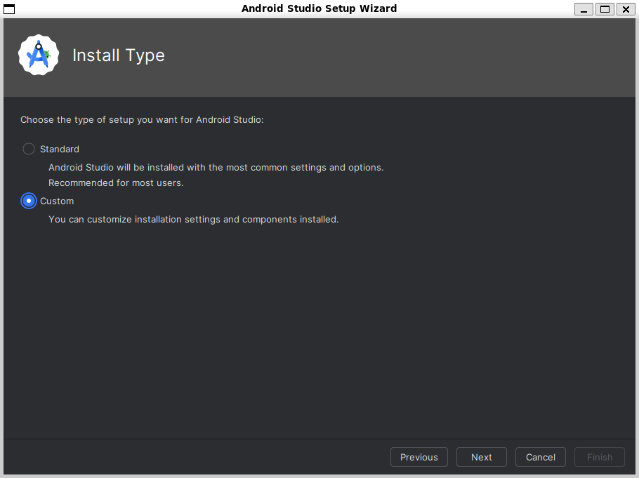
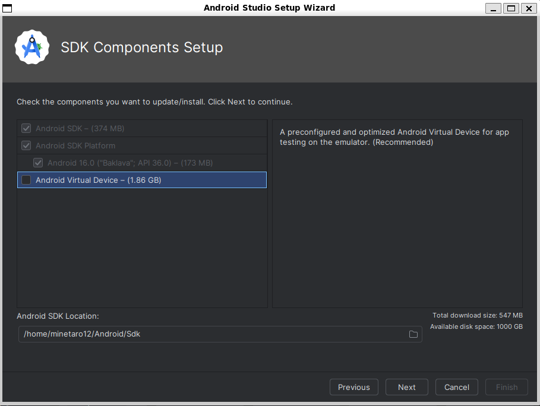

## 前提条件
- WSLが動作するWindows環境

## WSLのセットアップ

ここではUbuntu 24.04を使う

```powershell
wsl --install ubuntu-24.04 --name ubuntu
cd ~
```

ここからはWSL内で作業する

WSLが起動したら混乱防止でWindowsのパスを無効化する

`sudoedit /etc/wsl.conf`

```conf
[interop]
appendWindowsPath = false
```

パッケージのアップデートをかける

```bash
sudo apt update && sudo apt upgrade -y
```

## Node.jsをインストール

```bash
curl -fsSL https://deb.nodesource.com/setup_24.x | sudo bash
sudo apt install nodejs -y
sudo corepack enable
pnpm -v #確認が出てきたらyで進める
```

## 環境変数の設定

```bash
pnpm setup
echo "export ANDROID_HOME=/home/${USER}/Android/Sdk" >> ~/.bashrc
source ~/.bashrc
```

## eas-cliをインストール

```bash
pnpm i -g eas-cli
eas login  #expo.devのアカウントでログイン
```

## JDKをインストール

```bash
sudo apt install openjdk-21-jdk -y
```

## Android Studioをインストール

```bash
wget https://redirector.gvt1.com/edgedl/android/studio/ide-zips/2025.1.4.8/android-studio-2025.1.4.8-linux.tar.gz
sudo tar xzvf android-studio-2025.1.4.8-linux.tar.gz -C /opt/
/opt/android-studio/bin/studio.sh #起動
```

Android Studioが起動してInstall Typeまで来たら`Custom`を選択→`Android Virtual Device`のチェックを外して進める




## Expoのプロジェクトをセットアップ

```bash
pnpm dlx create-expo-app my-app
cd my-app
eas build:configure #確認が出たらy→Android,iOS,両方か選ぶ
```

必要に応じて`eas.json`を編集

`developmentClient`を`false`にしておく

## ビルド

```bash
eas build --platform android --profile development --local
```

どのくらいかかるかはPCの性能による

`--local`を外すとクラウドビルドになるが、回数制限あり＆時間かかる
