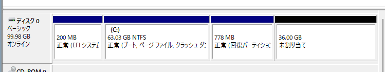
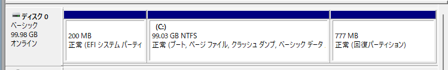

大きなサイズのディスクにクローンしたりするとパーティション構成が以下のようになってしまいCドライブの拡張を妨げてしまうので、回復パーティションの位置を変更するやり方のメモ  
ここからのコマンドは、管理者権限のコマンドプロンプトで実行をする。



## winreの退避
```
C:\Windows\System32>reagentc /disable
REAGENTC.EXE: 操作は成功しました。
```
このコマンドで、回復パーティションを無効にし必要なファイルをCドライブに退避させる。

## 回復パーティションを削除する
ここからは`diskpart`を使って作業を行います。  
ここでは対象のディスクが`ディスク1`、Cドライブが`Partition 3`、回復パーティションが`Partition 4`とします。
```
> diskpart

Microsoft DiskPart バージョン 10.0.26100.1150

Copyright (C) Microsoft Corporation.
コンピューター: DESKTOP-USJPNTU

DISKPART> list disk

  ディスク      状態           サイズ   空き   ダイナ GPT
  ###                                          ミック
  ------------  -------------  -------  -------  ---  ---
  ディスク 0    オンライン           100 GB    36 GB        *

DISKPART> select disk 0

ディスク 0 が選択されました。

DISKPART> list partition

  Partition ###  Type                Size     Offset
  -------------  ------------------  -------  -------
  Partition 1    システム               200 MB  1024 KB
  Partition 2    予約済み                16 MB   201 MB
  Partition 3    プライマリ               63 GB   217 MB <- CドライブはPartition 3
  Partition 4    回復                 778 MB    63 GB　<- 回復パーティションはPartition 4

DISKPART> select partition 4

パーティション 4 が選択されました。

DISKPART> delete partition override

DiskPart は選択されたパーティションを正常に削除しました。
```

## Cドライブのサイズを拡張する
```
DISKPART> select partition 3

パーティション 3 が選択されました。

DISKPART> extend

DiskPart はボリュームを正常に拡張しました。

DISKPART> list part

  Partition ###  Type                Size     Offset
  -------------  ------------------  -------  -------
  Partition 1    システム               200 MB  1024 KB
  Partition 2    予約済み                16 MB   201 MB
* Partition 3    プライマリ               99 GB   217 MB <- Cドライブのサイズが最大まで拡張された
```

## 回復パーティションを再作成
元の回復パーティションのサイズがここでは778MBだったため、その分のみCドライブを縮小させ再作成します。
```
DISKPART> select partition 3

パーティション 3 が選択されました。

DISKPART> shrink minimum=778 <- 778MBだけCドライブを縮小

ボリュームは、次の方法で正常に縮小されました:  778 MB

DISKPART> create partition primary <- 新しくパーティションを作成

DiskPart は指定したパーティションの作成に成功しました。

DISKPART> format quick fs=ntfs label=Recovery

  100% 完了しました

DiskPart は、ボリュームのフォーマットを完了しました。

DISKPART> set id=de94bba4-06d1-4d40-a16a-bfd50179d6ac

DiskPart は、パーティション ID を設定しました。

DISKPART> gpt attributes=0x8000000000000001

選択された GPT パーティションに DiskPart で属性を割り当てました。
```

## winreを元に戻す
`diskpart`を抜けた後、再度`reagentc`でファイルを元に戻せば完了です。
```
DISKPART> exit

DiskPart を終了しています...

C:\Windows\System32>reagentc /enable
REAGENTC.EXE: 操作は成功しました。
```


